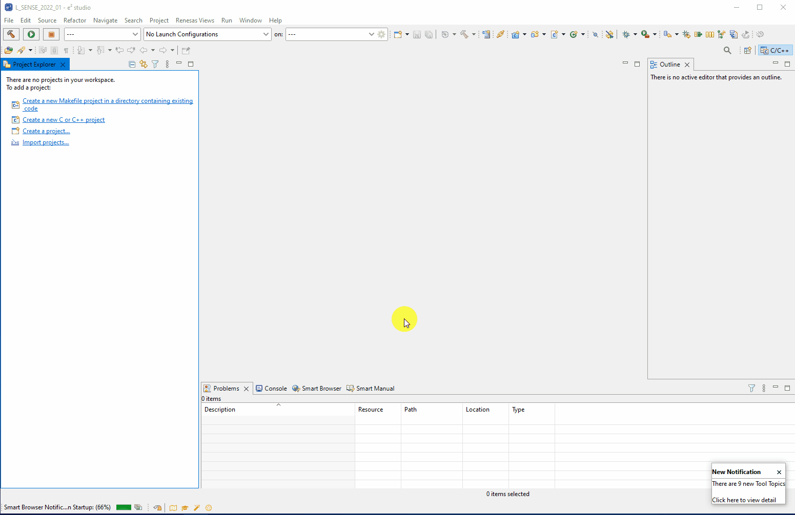

# rl78-g23-inductive-sense-shield
Repository containing the RL78/G23 64p FPB Inductive Proximity Sensing software.

## Acquiring the code
On checkout of this repository, navigate to the src folder in this repoistory and use e2studio's **Import** function.
- That is **File &rarr; Import...**
- Then select **General &rarr; Existing Projects into Workspace** & click **Next >**
- Choose **Select root directory:** & click **Browse...**
- Navigate to the local repository (top level is fine) & click **Select Folder**
- Optionally you can choose to copy the project into the workspace which will make a brand new copy of the project in the workspace folder\
Otherwise do not select this option which simply opens, in e2studio, directly the project in the local repository folder
- Then click **Finish**

The animation below shows the steps above (inc. copying the project).

## Repository Structure
Here we will provide a brief outline to the repo's structure.

### bin
Contains pre-built binaries for quickly flashing and evaluating the sample code.

### docs
Contains extra Inductive Proximity Sensing training material - targetted specifically at the RL78/G23 Inductive Proximity Sensing shield project.

### src
Contains the e2studio project ofr RL78/G23 64p FPB Inductive Proximity Sensing solution.
